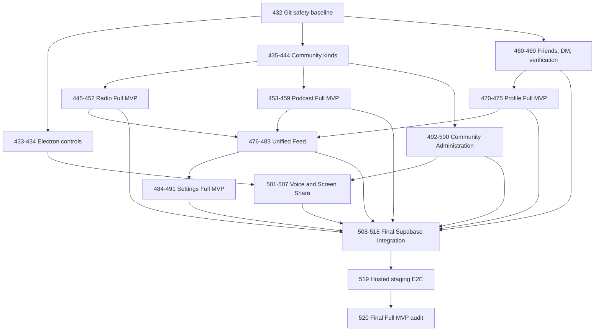

# Picom Full MVP Completion Scope Lock

Date: 2026-07-11
Baseline commit: `a3a855d4dfdea8a7a004ffb584936325a2cdc7f5`
Execution pack: Tasks 431-520

## Product boundary

Picom Full MVP is a Windows, Linux, and macOS Electron community application. It keeps the existing premium desktop shell, Picom design tokens, Coolicons/AppIcon contract, mock data source, Supabase adapter boundary, Electron security settings, and release safeguards.

The completion sequence may extend existing code but must not destructively reimplement working Community Chat, Mention Feed, Profile, Direct Messages, Voice, Screen Share, Radio, Podcast, Settings, installer, or release behavior.

## Release-scope capabilities

- Secure Electron shell with working minimize, maximize/restore, close, drag, frame, and persisted window state.
- Three first-class community kinds: `text`, `radio`, and `podcast`.
- Kind-aware community creation, templates, routing, membership, roles, invites, permissions, and administration.
- Text community chat, channels, messaging, replies, reactions, attachments, moderation, unread state, and realtime.
- Radio hosting, production controls, listener playback, schedule, events, notifications, moderation, feed, profile, and community integration.
- Podcast publishing, episode management, playback queue/resume, reactions, comments, saves, moderation, feed, profile, community, and search integration.
- Friendship requests, presence, suggestions, privacy, notifications, and Direct Messages.
- Full profile editing, avatar/cover storage, privacy, stats, activity, media, audio, follow/friend, and verification integration.
- Unified text/radio/podcast mention feed with stories, tabs, filters, actions, companion rail, realtime refresh, unread, and cache behavior.
- Complete desktop Settings architecture covering account, security, profile, privacy, appearance, accessibility, language, motion, notifications, voice/video/audio, diagnostics, logs, cache, and data controls.
- Mature community role hierarchy, assignments, channel/category/audio-section management, visitor/public/private behavior, moderation, audit, danger zone, ownership transfer, branding, and rules.
- LiveKit voice and Electron screen share with protected token issuance, permissions, reconnect, publishing, remote rendering, stop, cleanup, and moderation boundaries.
- Supabase Auth, Postgres, RLS, Storage, Realtime, and release-scoped Edge Functions through service/repository/data-source layers.
- Mock and Supabase validation, hosted staging E2E, and final Full MVP completion audit.

## Explicit exclusions

The following are not part of Tasks 431-520 unless separately approved after Task 520:

- Bots or bot marketplace.
- Production webhooks.
- Plugin runtime or marketplace.
- Enterprise console, SSO, or SCIM.
- Billing or paid verification.
- Public discovery marketplace.
- Mobile applications or mobile navigation.
- Production AI features or AI-generated moderation decisions.
- E2EE production rollout.
- Production auto-update rollout.
- Advanced analytics beyond existing safe operational summaries.

Existing legacy migrations or guarded code for excluded features are not authority to expose those features in Full MVP. They remain disabled, deferred, or outside release claims.

## Non-negotiable architecture decisions

1. `text`, `radio`, and `podcast` are first-class community kinds, not tabs inside one text-channel tree.
2. Shared membership, role, invite, profile, verification, moderation, and audit foundations may be reused through kind-aware policies.
3. UI components never call Supabase directly. Existing services, repositories, and data-source adapters are extended.
4. Mock mode remains operational through Task 518 and cannot silently diverge from Supabase contracts.
5. Existing migrations are append-only. Duplicate historical migrations are audited and superseded safely rather than rewritten after deployment.
6. Verification remains approved-only, role-independent, and sourced through the canonical `VerificationSummary` contract established at `a3a855d`.
7. Electron remains `frame: false`, `contextIsolation: true`, `nodeIntegration: false`, and `sandbox: true` where currently supported.
8. Hosted/native/provider evidence is never inferred from local smoke tests.
9. Stable release remains `NO-GO` until the canonical release blockers are closed with attributable evidence.

## Execution order

Tasks execute exactly one at a time in numeric order. Every task follows:

1. Inspect status and existing implementation.
2. Extend rather than duplicate.
3. Implement only the current task.
4. Run relevant tests and contracts.
5. Write the task checkpoint.
6. Stage task-related files only.
7. Commit with the task's exact message.
8. Push and verify required CI before advancing.

## High-level dependency graph

## Release decision

This scope lock does not authorize a release. Current decision remains **NO-GO**. Task 520 may recommend release readiness only after hosted, native, legal, ownership, restore, and artifact evidence is truthful and complete.

